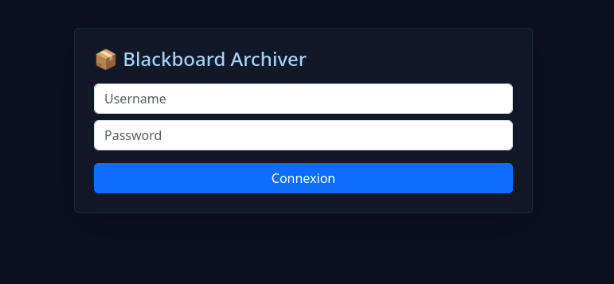
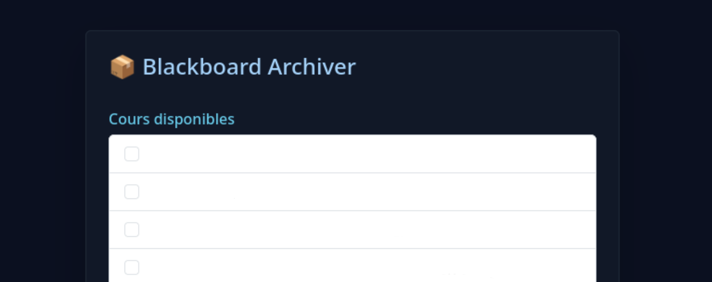
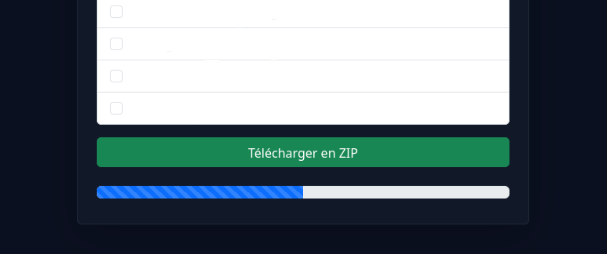

# Blackboard-Archive-WebUi
A Simple WebUi to collect attachments from blackboard in python with only requests

To get start, you can use `bash start-web-ui.sh` if you are on linux

Or just start `start-web-ui.bat` if you are on windows !

It's very usefull if you want to archive alls the attachments of your course.

here is some screenshot of the Web UI

### **Login Form**

### **Export Section Screen**

### **Progress Bar and Downloads Button**

---

If you are worry about the empty sections in the screenshots, don't worry, it's just a mask over my courses. In your case, you will see your own courses ;)

